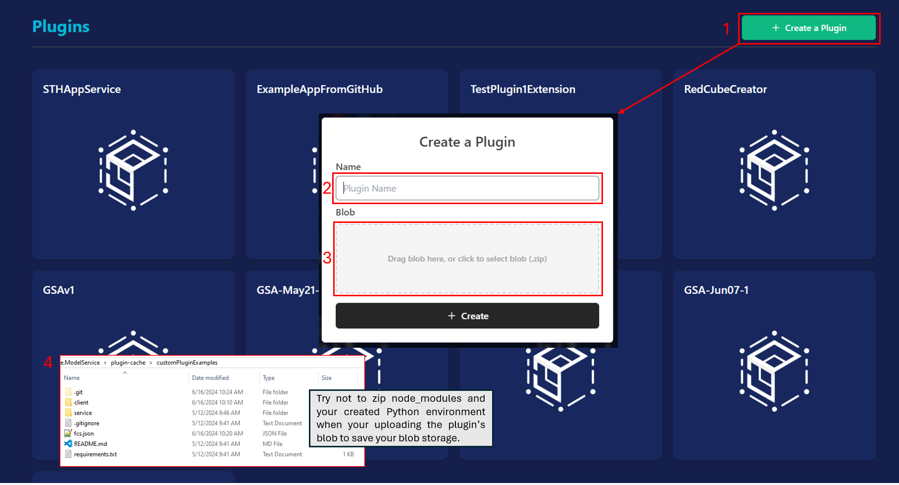
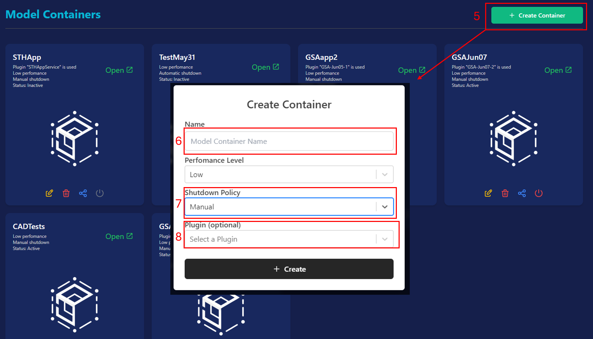
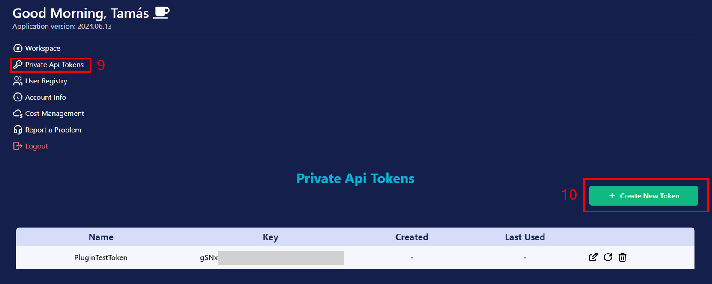

# FCS Custom Application Integration Example
This repository provides example of simple NodeJS browser apps that can connect to the Femsolve Cloud Services (FCS) platform.  

# Workflow
The workflow comprises of 2 different set of consecutive steps. First, we need to upload our plugin to the platform, create a container that will inject the plugin, and generate a private API token. Secondly, the user will need follow consecutive API calls to be able to embed the application in their own platform (webshop, configurator, engineering application, etc.).

## Assumptions
Note, this example code does NOT show how you can create a plugin yourself and already assumes that you have an existing plugin/service code written. If you need guidance on how you can create you own custom engineering applications, please visit the https://github.com/Femsolve-Engineering/FCS.Core.CustomPluginExamples repository page.

## Platform Setup
Before any further steps are taken it is assumed that you are already registered with the FCS service and have been cleared for using the services.

1. Click on Create Plugin, this will pop up the plugin creation dialog.
2. Set a plugin name that has to be unique among the plugins you own.
3. Click on the blob upload section to upload the runnable scripts of your plugin.
4. Make sure to upload a Zip of your plugin that ideally does not include node_modules and the Python environment that are really only needed for local development.

5. Click on Create Container, this will pop up the container creation dialog.
6. Set a container name that has to be unique among the containers you own. 
7. Make sure to set shutdown policy to Manual IF you wish to use this container as a constantly running service. 
8. Select the just created plugin that you want to inject into the container.

9. Click on Private Api Tokens in the top menu.
10. Click on Create New Token to generate a private API token to access your account from your server code. Make sure to save both the key and secret of the private API token in a safe place.

## FCS API Workflow
To be able to access a specific running container's services you will need the following parameters:
- `FCS_API_BASE_URL` - the platform's base URL, for development this will be https://api.dev.femsolve.com, e.g.
- `FCS_API_TOKEN_KEY` - key of your private API token
- `FCS_API_TOKEN_SECRET` - secret of your private API token
- `PLUGIN_CONTAINER_NAME` - name of your container

1. `POST ${API_BASE_URL}/api/auth/pat/sign-in` - Sign-in with you private API token and request a refresh and access token. Your access token shall be used to access all upcoming API calls. In the POST request's body include the key and secret properties of your private API token.
2. `GET ${API_BASE_URL}/api/model-containers` - In the response body's data it will contain a 'models' propetry that will contain a list of model containers that are currently available on the platform. Use the 'PLUGIN_CONTAINER_NAME' to filter out which container you want to connect to. The model container's object will contain its container ID, that you will need to specify when requesting an access URL.
3. `POST ${API_BASE_URL}/api/model-containers-instances/sessions/${containerId}` - This request will startup a container if it is not yet running and thus it may take up to two minutes to receive a response. With the response received, it will have three properties: 
- `proxyAdress`: The base URL of the container
- `containerAddressNumber`: The container address number that the proxy address needs to be appended with.
- `sessionToken`: The token for authentication and to actually be able to use the services.